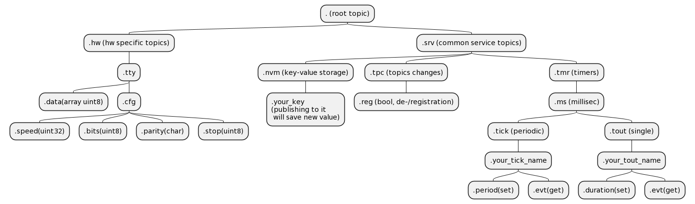

# pubsub_actors
framework that implements actors model for simple and safe multitasking in C using only static memory allocation and intended for use in embedded systems. It's still in research 
and development state, not ready for any practical use!

# main principles
1) actors are simple functions that run until completion and are interacting only by means of a common message bus.
2) the message bus is a publisher/subscriber copy-based data distribution subsystem with possibility to mute specific publishers.
3) messages carry only generic typed payloads (for example, bool or int32 or string) with simple and unambiguous meaning (for example, count of pulses is int32, speed from GPS is float, switch states is bool).
4) message's content is described in message's topic - record in pub/sub queue manager's list that holds data description as "path" in suffix tree separated by dots, data type and size in memory. For example, valid path could be ".hw.tty.cfg.speed" - path to console speed topic that sets and holds (if made "sticky") information about speed setting of UART on the board.

# main goals
1) decoupling of the software modules to maximum possible level where the ONLY interaction between the modules goes through common copy-based message queue based on publisher/subscriber model. Advantages of the approach are following:
  a) simplified testing and design (single interaction point makes testing much easier).
  b) easy creation of distributed systems (for example HMI runs on dedicated linux PC and low-level control on MCU). 
  c) development flexibility, when complete HW/FW specifications are not ready yet (complete system can be build out of simplified imitating software modules that will be replaced one by one with real logic during implementation).
  d) absolute abstraction from HW dependencies. Any signal can be simulated as a message in the queue.
  e) simplified FIL and HIL testing as well as debugging, every module can be investigated and controlled in field by means of manipulation with its subscriptions/posts (for example via UART terminal) with close to zero effort for maintaining such capabilities (thanks to unified interface of actors).
2) simple and safe multitasking model (no synchronization primitives, no stack switching);
3) greate traceability in case of fimware problems (events history can be logged simply and precisely if necessary). 
4) event driven work of the system for simple implementation of the power saving mode.
5) portability at extrem level - thanks to no need in tightly HW dependent features like context switching and recovering.
6) adding a feature in a subset of modules shouldn't require changes in the rest of the modules (when data consumer whants subscribe to additional information it shouldn't require any changes in data producer or message queue manager. And when publisher has some information it should publish it even if there is no a consumer that could be able to use it.

# todo
1) add wakeup and sleep callbacks for simple low power mode integration.
